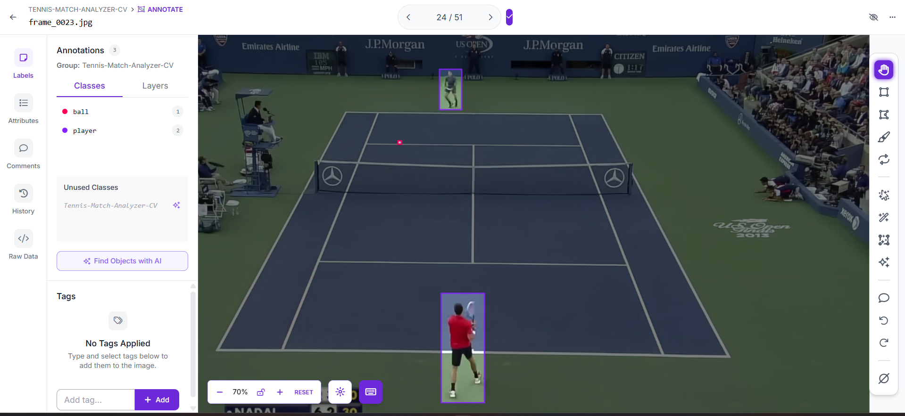
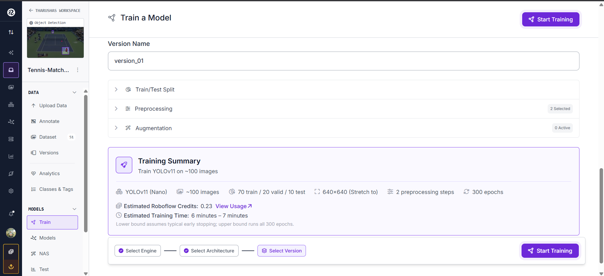
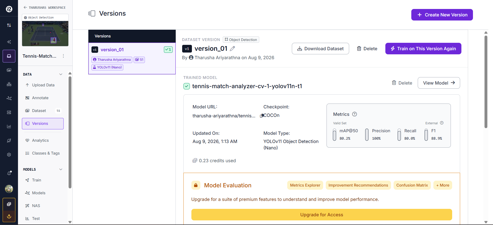
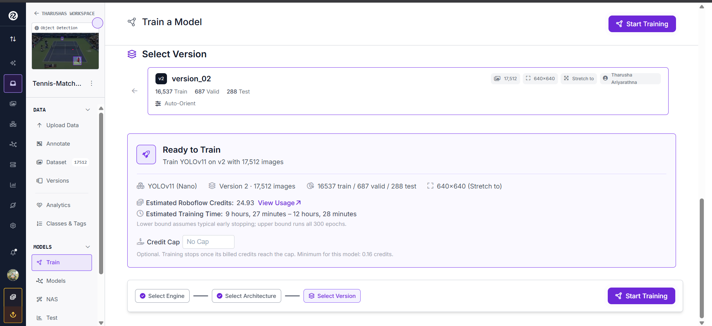
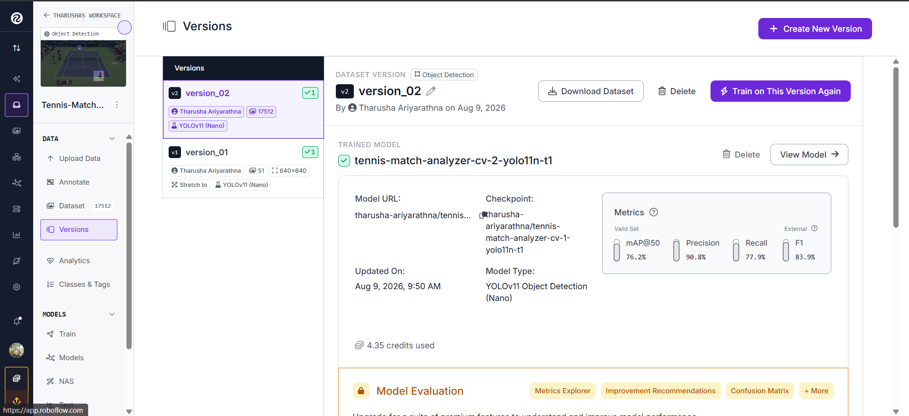
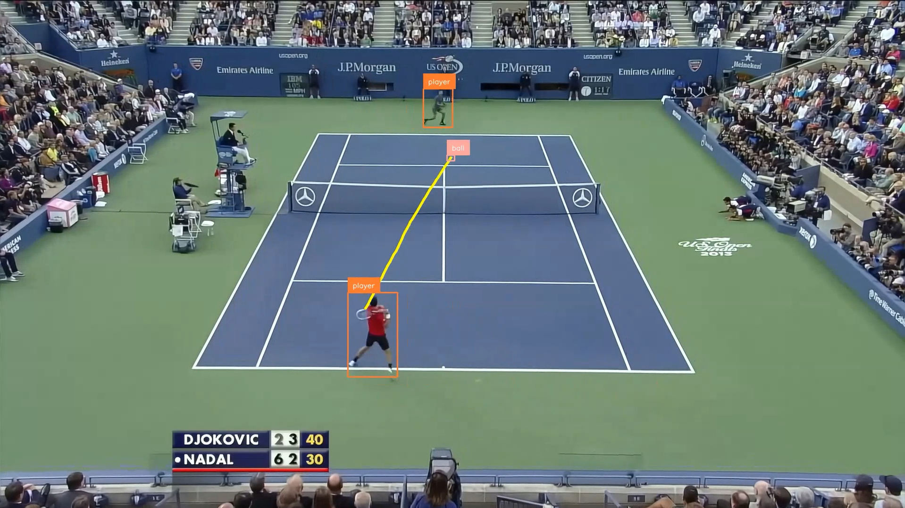

# 🎾 Tennis-Match-Analyzer-CV

> An advanced Computer Vision project for analyzing broadcast tennis matches, featuring real-time player detection, high-speed tennis ball tracking, and smoothed trajectory mapping.

## 📌 Overview
Tennis-Match-Analyzer-CV utilizes a custom-trained YOLOv11 Instance Segmentation and Object Detection model via Roboflow and OpenCV to accurately identify tennis players and the ball during a match. The script processes standard MP4 video, overlays bounding boxes with tracking IDs, and traces the dynamic path of the tennis ball using a digital signal processing filter for smooth visualization.

## ✨ Features
* **Player Detection & Tracking:** Accurately identifies players and tracks them continuously across frames using ByteTrack (via Supervision).
* **High-Speed Ball Tracking:** Detects the tennis ball during rapid rallies and handles occlusion through linear interpolation.
* **Trajectory Mapping:** Visualizes the dynamic path of the ball using a continuous, smoothed trailing line via the Savitzky-Golay filter.
* **Automated Processing:** Processes input match footage and outputs a fully annotated demonstration video.

## 🎥 Demo
The project processes the input video (`input_videos/test_video.mp4`) frame-by-frame and generates an annotated output file named `output_tracked_video.mp4`, showcasing the real-time detections and trajectory tracking.

▶️ **[📺 Watch the Processed Demo Video](https://youtu.be/2upUYxgwpcc)**

## 🖼️ Screenshots

### 1. Data Annotation

> *Manually annotating tennis players and the ball using the Roboflow platform. Accurate bounding boxes are essential for training a robust instance segmentation dataset.*

### 2. Model Training Configuration (Version 1)

> *Initial training configuration using a small sample of ~100 images to test the YOLOv11 Nano architecture and preprocessing steps.*

### 3. Initial Model Evaluation (Version 1)

> *The initial model achieved a promising 80.2% mAP@50 and 100% Precision, proving the concept before scaling up the dataset.*

### 4. Scaled Model Training (Version 2)

> *Scaling up the project by configuring the dataset (v2) with over 17,500 images to drastically improve the model's accuracy and robustness in complex match conditions.*

### 5. Final Model Architecture

> *The final deployed version of the YOLOv11 Object Detection (Nano) model, ready for integration via the Roboflow Serverless Cloud API.*

### 6. Inference & Trajectory Tracking (Final Output)

> *The final processed output showcasing real-time player detection, tennis ball tracking, and the continuous smoothed trajectory (yellow line) calculated using the Savitzky-Golay filter during a fast-paced rally.*

## 🛠️ Tech Stack
* **Language:** Python 3.x
* **Computer Vision:** OpenCV (`opencv-python`)
* **Tracking & Annotation:** Supervision (`supervision`)
* **AI / ML API:** Roboflow Inference SDK (`inference`, `inference-sdk`)
* **Math & Filtering:** NumPy (`numpy`), SciPy (`scipy`)

## 🧠 Model / Methodology
* **Architecture:** YOLOv11 Object Detection / Instance Segmentation (Nano)
* **Training Data:** Custom annotated dataset for `player` and `ball` classes.
* **Deployment:** Serverless Cloud API via Roboflow `get_model` inference.
* **Smoothing Algorithm:** Savitzky-Golay filter combined with coordinate distance interpolation.

## 📊 Results
The custom-trained YOLOv11 Nano model achieved the following baseline metrics on the validation set:

| Metric | Score |
|---|---:|
| mAP@50 | **80.2%** |
| Precision | **100.0%** |
| Recall | **80.0%** |

## 📁 Project Structure

```text
Tennis-Match-Analyzer-CV/
│
├── .venv/                      # Python virtual environment
├── extracted_frames/           # Extracted video frames for dataset preparation
├── input_videos/               # Directory for raw input footage
├── output_videos/              # Directory for processed output videos
├── Screenshots/                # Images used for README documentation
├── utils/                      # Helper scripts and utility functions
│
├── .gitignore                  # Git ignore rules
├── draw_boxes.py               # Testing script for basic bounding box drawing
├── extract_frames.py           # Script used to extract frames from video for training
├── process_video.py            # Main inference and video processing pipeline
├── requirements.txt            # Python dependencies (OpenCV, Supervision, SciPy, etc.)
└── test_model.py               # Single-frame inference testing via Roboflow API

```

## ⚙️ Installation

1. **Clone the repository:**

```bash
git clone [https://github.com/tharusha0010/Tennis-Match-Analyzer-CV.git](https://github.com/tharusha0010/Tennis-Match-Analyzer-CV.git)
cd Tennis-Match-Analyzer-CV

```

2. **Create and activate a virtual environment (Recommended):**

```bash
python -m venv .venv
# For Windows:
.venv\Scripts\activate
# For Mac/Linux:
source .venv/bin/activate

```

3. **Install the required dependencies:**

```bash
pip install -r requirements.txt

```

## 🚀 Usage

Ensure that your target video is placed inside the `input_videos/` directory (e.g., `test_video.mp4`).

Run the main Python script to process the video:

```bash
python process_video.py

```

*The script will read the input video, communicate with the Roboflow Inference API, smooth the trajectories, and generate the annotated `output_tracked_video.mp4` file in the `output_videos/` directory.*

## 🔮 Future Improvements

* **Speed Calculation (KM/H):** Implementing homography transformations to calculate the real-time speed of the ball in meters per second.
* **2D Tactical Mini-Map:** Utilizing perspective transforms to map player and ball movements onto a top-down 2D court graphic.
* **Automated Court Calibration:** Enhancing the dynamic detection of court lines to better handle camera panning and zooming.

## 👨‍💻 Author

**Tharusha Ariyarathna**

```